# Mutable/Immutable
Mutable objects can be changed, while immutable objects can't.

<br>

# Implicit/ Explicit
Explicit describes something that is very clear and without vagueness or ambiguity. Implicit often functions as the opposite, referring to something that is understood, but not described clearly or directly, and often using implication or assumption.

<br>

REPL -Read Evaluate Print Loop -all shells are repls

<br>

# Absolute and Relative
An absolute path refers to the same location in a file system relative to the root directory, whereas a relative path points to a specific location in a file system relative to the current directory you are working on.
ps command

    man -for manual, read the manual

    man ps

    less -page through files

    man less

    man zsh

    whoami -user of the comp

    hostname -name of my comp

# $: 
$ sign is used in the shell to retrieve the value of variables.

echo: echo command is used to print the text or string to the shell or output file.

    echo 'hello world'

    echo $SHELL

    echo $USER

    echo $HOME

    which ls

    which echo

    mkdir pantera

    nano test.js

    cat test.js

    man node

    node test.js

    nano README.md

    which git

    ls -la

    ls .git

    rm -r .git

    git init

    git branch -m main

    git remote -v

    git push -u origin main

    git diff README.md

    git push origin main

    history

    env

<br>

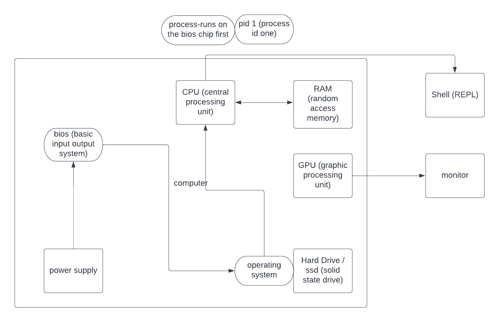

<br>
<br>

# 6.6.2022

strings are arrays of characters
when a string is interpeted you can use \ to escape characters
string literals are not interpreted

folders are directories

cd takes me to home directory

homework:
list all escape characters in javascript and zshell

<br>

## zsh

escape -double-quotes in double-quotes

escape -$'s in double-quotes

escape -the escape character \

don't escape the single-quotes -- you don't want a literal single-quote, but just group the command into one parameter

## JavaScript

\b -Backspace

\f -Form Feed

\n -New Line

\r -Carriage Return

\t -Horizontal Tabulator

\v -Vertical Tabulator

<br>

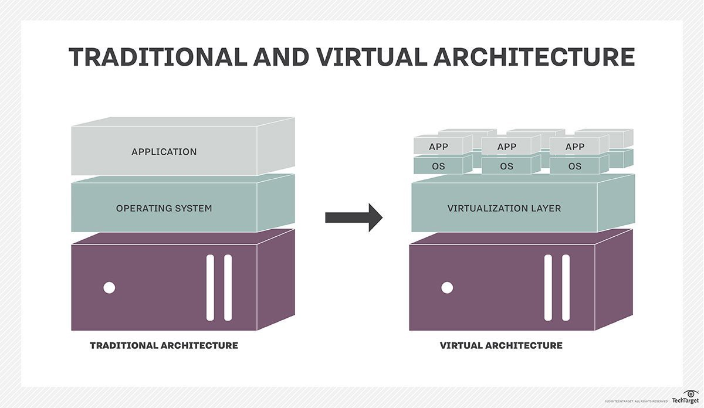

<br>

# Hypervisor 
also known as a virtual machine monitor or VMM, is software that creates and runs virtual machines (VMs). A hypervisor allows one host computer to support multiple guest VMs by virtually sharing its resources, such as memory and processing.

<br>

# A Virtual Machine (VM) 
is a compute resource that uses software instead of a physical computer to run programs and deploy apps. One or more virtual “guest” machines run on a physical “host” machine. Each virtual machine runs its own operating system and functions separately from the other VMs, even when they are all running on the same host. This means that, for example, a virtual MacOS virtual machine can run on a physical PC.

<br>

# c group 
is a mechanism to organize processes hierarchically and distribute system resources along the hierarchy in a controlled and configurable manner. cgroup is largely composed of two parts - the core and controllers. cgroup core is primarily responsible for hierarchically organizing processes. A cgroup controller is usually responsible for distributing a specific type of system resource along the hierarchy although there are utility controllers which serve purposes other than resource distribution. cgroups form a tree structure and every process in the system belongs to one and only one cgroup. All threads of a process belong to the same cgroup. On creation, all processes are put in the cgroup that the parent process belongs to at the time. A process can be migrated to another cgroup. Migration of a process doesn’t affect already existing descendant processes.

<br>

# Virtualization 
is the creation of a virtual -- rather than actual -- version of something, such as an operating system (OS), a server, a storage device or network resources. Virtualization uses software that simulates hardware functionality to create a virtual system. This practice allows IT organizations to operate multiple operating systems, more than one virtual system and various applications on a single server. The benefits of virtualization include greater efficiencies and economies of scale.

<br>

    curl -L 'https://www.dropbox.com/s/k6xcq55tqanbdmz/countries.txt?dl=0' 

    curl -L 'https://www.dropbox.com/s/k6xcq55tqanbdmz/countries.txt?dl=0' > curlCountries.txt

    curl -L 'https://www.dropbox.com/s/k6xcq55tqanbdmz/countries.txt?dl=0'

    curl -L 'https://www.dropbox.com/s/k6xcq55tqanbdmz/countries.txt?dl=0' | grep United

    man grep
    
    curl -L 'https://www.dropbox.com/s/k6xcq55tqanbdmz/countries.txt?dl=0' | grep "^U"

 <br>

# Big O notation
Big O analogy: Let's say you're making dinner for the family. O is the process of following a recipe, and n is the number of times you follow a recipe. O- you make one dish that everyone eats whether they like it or not. You follow one recipe from top to bottom, then serve (1recipe). <-- How I grew up O(n) - you make individual dishes for each person. You follow a recipe from top to bottom for each person in the family (recipe times the number of people in the family). O(n^2) - you make individual dishes redundantly for every person. You follow all recipes for each person in your family (recipe times the number of people squared). O (log n) - you break people into groups according to what they want and make larger portions. You make one dish for each group (recipe times request)

We use big-Θ notation to asymptotically bound the growth of a running time to within constant factors above and below. Sometimes we want to bound from only above.

<br>

## 6.14.22

### Entropy- lack of predictability

    git checkout -b doze/deploy

    git diff

    nano deploy.sh

    bash deploy.sh

    man sudo

    git add strings.js deploy.sh

    git commit -m 'add deploy script'

## copy file
`tar -cf pantera-550f491.tar pantera/` 

<br>


# What is Jira project management?
Jira Software is an agile project management tool that supports any agile methodology, be it scrum, kanban, or your own unique flavor. From agile boards, backlogs, roadmaps, reports, to integrations and add-ons you can plan, track, and manage all your agile software development projects from a single tool.

<br>

# User story mapping- 
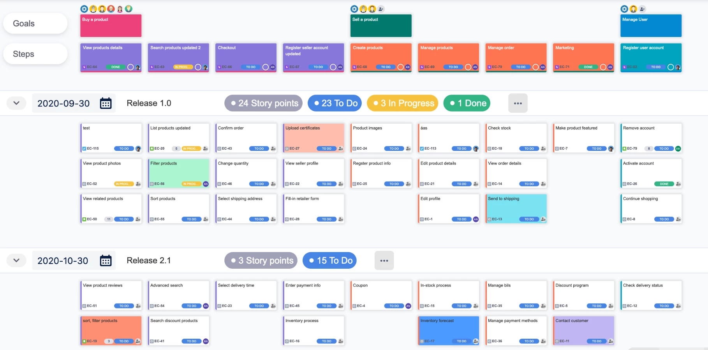

<br>
<br>

# Compiled vs. Interpreted Language

<br>

# Compiled Language
* Language is written and compiled to machine code inside of an application
* Errors are detected during compiling
* The code won’t compile until it’s error-free
* Examples: C, C++, Erlang, Go

# Interpreted Language
* Errors found when the code is run
* The interpreter translates and runs code one statement at a time
* Interpreted code runs more slowly

<br>

# How to Build a DevOps Pipeline
 Common steps include establishing a CI/CD tool, sourcing a control environment, setting up a build server, setting up build automation tools for testing, and deploying to production.

<br>

## Step 1: Establish CI/CD Tool
Pick a CI/CD tool based on needs.

<br>

## Step 2: Source a Control Environment
 Source control management tools such as Git allow collaboration with team members, storing code from each developer in a separate shared repository. 

<br>

## Step 3. Set up a Build Server
Setting up a build server, a continuous integration (CI) server, is the next step before a project can make its way down the rest of the pipeline. A build server is a centralized environment for building distributed development projects. Build servers retrieve integrated code from source code repositories, acts as an integration point for developers, and provides an environment to make sure that the code actually works.

<br>

## Step 4. Setup or Build Automation Tools for Testing
Once code is configured on the build server, it is ready to test. Developers run automated tests to ensure that error-free code continues down the pipeline to the deployment stage. Several automated tests are performed at the testing stage including unit, functional, integration, and regression tests. Most tests are run through CI and run one after the other.

<br>

## Step 5. Deploy to Production
Software is ready to be pushed to production. 
Deploy the code by configuring the build server to run a script to deploy the application. This can be set up to run automatically or you can do it manually. Automatic deployment should only be used if you are fully confident that bad code won’t end up in production. You can link this to the test builds, so that the script only runs if all the tests have been passed.

<br>

## What is an artifact server?
An artifact repository stores build artifacts produced by continuous integration and makes them available for automated deployment to testing, staging, and production environments.

Build artifacts are the files created by the build process, such as distribution packages, WAR files, logs, and reports. Artifacts can either be stored in a repository on the CI server, or in an external location available to the CI server.

When you’re committing changes regularly, an automated CI/CD pipeline produces a considerable number of builds each day. The nature of the pipeline means many builds will deploy to the first few environments before an issue is identified, while a smaller number of builds will make it all the way to be released to live.

An artifact repository provides a central location to store those builds, and most expose an API to automatically deploy builds to the environments in the pipeline. As part of the pipeline logic, you can specify how long builds should be kept in the repository and conditions for removing artifacts to free up space.

<br>

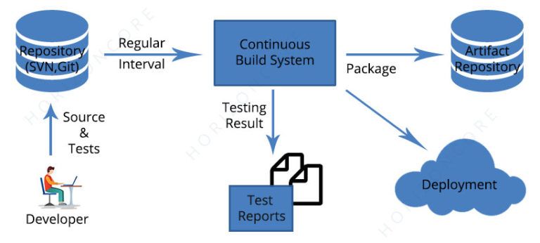

<br>

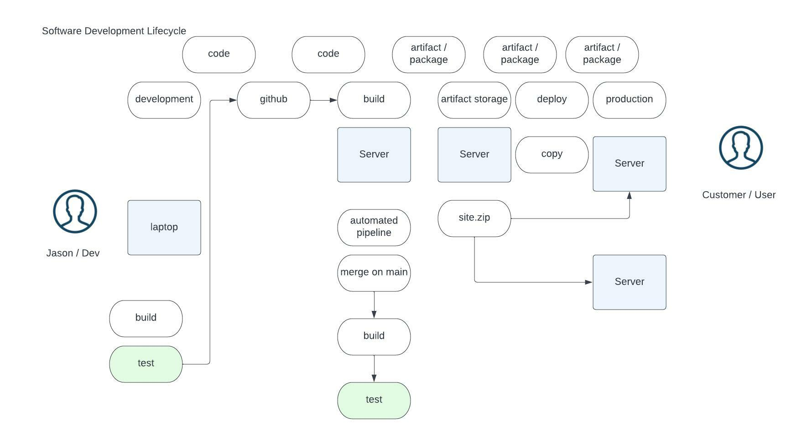
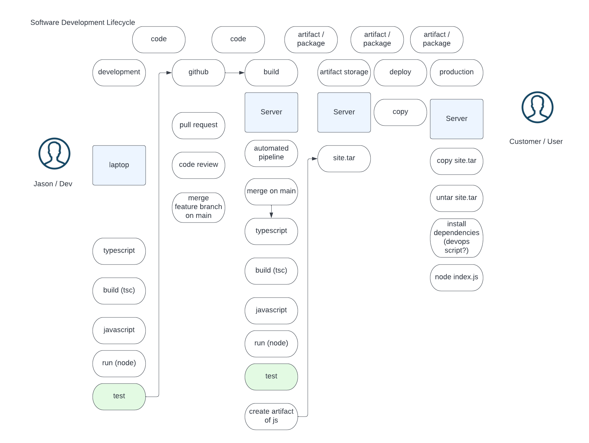

<br>

# secure shell SSH


<br>

# RSA 
(Rivest–Shamir–Adleman) is a public-key cryptosystem that is widely used for secure data transmission. It is also one of the oldest. The acronym "RSA" comes from the surnames of Ron Rivest, Adi Shamir and Leonard Adleman, who publicly described the algorithm in 1977. An equivalent system was developed secretly in 1973 at GCHQ (the British signals intelligence agency) by the English mathematician Clifford Cocks. That system was declassified in 1997.

In a public-key cryptosystem, the encryption key is public and distinct from the decryption key, which is kept secret (private). An RSA user creates and publishes a public key based on two large prime numbers, along with an auxiliary value. The prime numbers are kept secret. Messages can be encrypted by anyone, via the public key, but can only be decoded by someone who knows the prime numbers.

The security of RSA relies on the practical difficulty of factoring the product of two large prime numbers, the "factoring problem". Breaking RSA encryption is known as the RSA problem. Whether it is as difficult as the factoring problem is an open question. There are no published methods to defeat the system if a large enough key is used.

RSA is a relatively slow algorithm. Because of this, it is not commonly used to directly encrypt user data. More often, RSA is used to transmit shared keys for symmetric-key cryptography, which are then used for bulk encryption–decryption.

<br>

# SSH
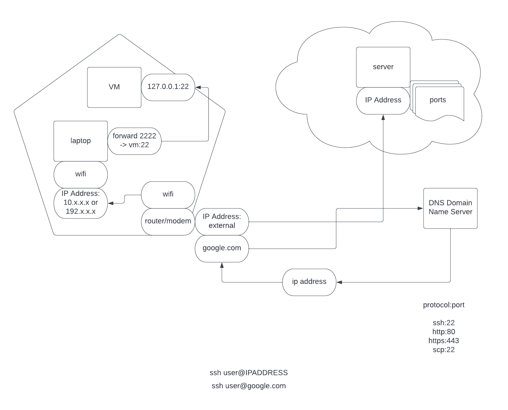

<br>

# IAC Infrastructure as Code

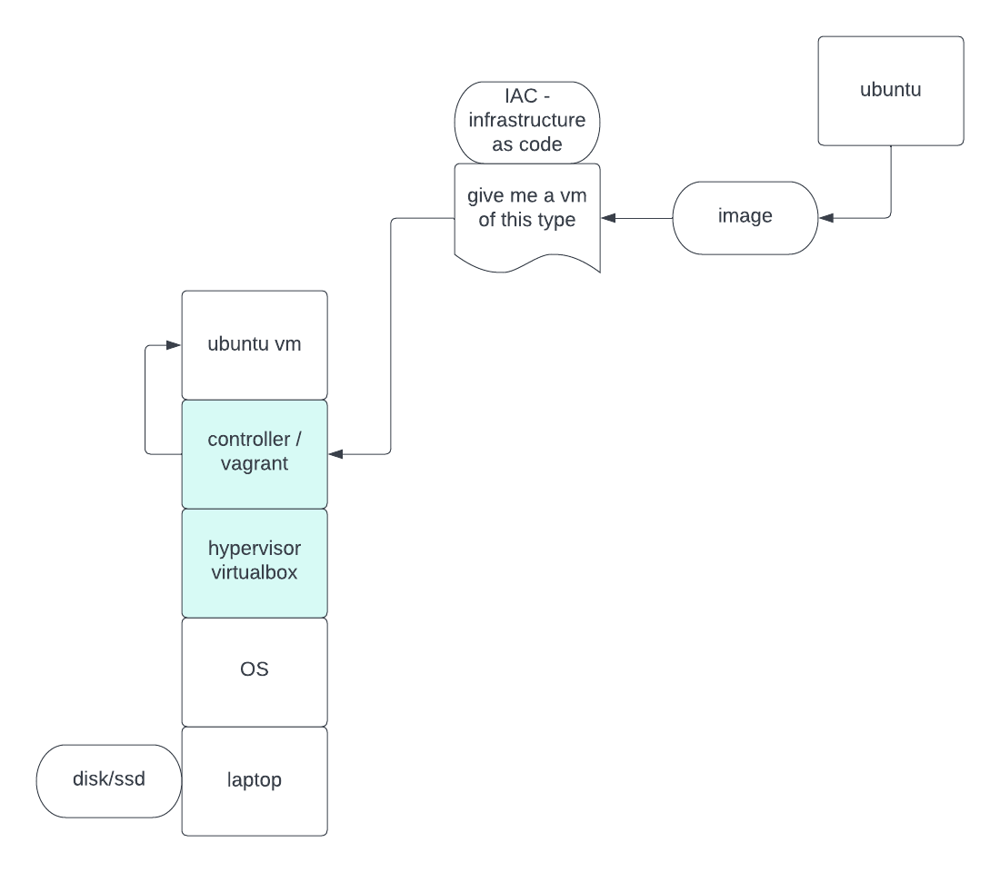

<br>


# Vagrant(s)
`brew install vagrant virtualbox`

allow vbox in system security

run install again

    mkdir provision

    cd provision

    vagrant init

### In the Vagrantfile “base” change that to “hashicorp/
bionic64”

    vagrant up

    vagrant ssh

    exit

    vagrant destroy

    vagrant help

<br>

    default: Forwarding ports...

    default: 22 (guest) => 2222 (host) (adapter 1)

    default: Booting VM...

    default: Waiting for machine to boot. This may take a few minutes...

    default: SSH address: 127.0.0.1:2222
    default: SSH username: vagrant
   
    vagrant@vagrant:~$ exit
    logout
    Connection to 127.0.0.1 closed.


    cd .ssh

    cat id_ed25519.pub

    cd ..

    ssh vagrant@localhost -p 2222

    cat ~/.ssh/id_ed25519.pub

    ssh -i ~/.ssh/id_ed25519 vagrant@localhost -p 2222

    history 0

    nano .ssh/authorized_keys 

    exit

    apt update

    sudo apt update

    sudo apt install nginx

    curl http://localhost:80

    history

    sudo apt update

    sudo apt install nginx
    
<br>

# Port Forwarding


<br>

```
echo 'Jason' 
echo 'Jason' > names.txt
cat names.txt
echo 'Steve' > names.txt
cat names.txt
echo 'Jason' >>  names.txt
cat names.txt
which vagrant
vagrant --version
which virtualbox
brew reinstall --cask virtualbox
vagrant up
vagrant ssh
cd /var/www
sudo mkdir tutorial
cd tutorial
sudo "${EDITOR:-vi}" index.html
cat /var/www/viking/index.html 
cd /etc/nginx/sites-enabled/
sudo nano viking
sudo systemctl restart nginx
curl localhost:81
cat viking
cp viking /vagrant/
```


Explain the provision script files, index, provision
viking
server {
       listen 81;
       listen [::]:81;

       server_name viking.jdoze;

       root /var/www/viking;
       index index.html;

       location / {
               try_files $uri $uri/ =404;
       }
}


* The code starts with the server listening on port 81.		
* The code then listens for connections on all ports, but specifically port 81.	
* It also specifies that it will be called viking.jdoze and that its root is /var/www/viking.		
* The location directive tells Apache to serve files from a specific directory if they are requested by the client at the given URI (in this case, http://viking).	
* If not found in that directory, Apache will return a 404 error message to the client instead of serving up an HTML file or other content.	
* The code attempts to serve the viking.jdoze domain with a default page, index.html, which will be served if the requested URL does not exist.		
* The server listens on port 81 and will listen for connections on any other ports by forwarding them to port 81.


    provision.sh

      #!/bin/bash

      sudo apt update

      sudo apt install -y nginx

      sudo mkdir /var/www/viking

      sudo cp /vagrant/index.html /var/www/viking/index.html

      sudo cp -r /vagrant/images /var/www/viking/

      sudo cp /vagrant/viking /etc/nginx/sites-enabled/viking

      sudo systemctl restart nginx

* The code starts by updating the system.
* Then it installs nginx and creates a directory for the website, which is called viking.
* It then copies over index.html into that directory, as well as all of the images from vagrant/images to viking/images.
* Finally, it copies over the file /vagrant/viking to /etc/nginx/sites-enabled/viking so that when you restart nginx, it will use this configuration file instead of default one in /etc/.
* The code is used to install nginx on the host machine.
* The code creates a directory called /var/www/viking and copies index.html into it.	
* The code then copies all of the files from the vagrant folder into the newly created directory in /var/www/viking.

Figure out how to add the public ssh key
Craft an ssh command to use instead of vagrant ssh
Figure out how to add public key to vagrant vm
Ssh -i  vagrant@localhost -p 2222 -make this command work


<br>


# Awk     -read about Bash exit codes
awk - pattern-directed scanning and processing language

    awk ‘cmds’ file(s)      Invokes the awk commands (cmds) on the file or files (file(s))

    $1 $2 $3...             Denotes the first, second, third, and so on fields respectively in a file

    $0                      Denotes an entire line in a field

    {.....}                 Whatever is inside these brackets is treated as an executable step (i.e., print, x=3, n=5+$32, getline).

    {print...}              Prints whatever is designated to the screen unless the output is redirected to a file

    (...)                   Whatever is inside these brackets is used to test for patterns (if--then...else, while, etc.)

    awk -f prog inputf      If the awk command line is very long, it may be placed in a program file (prog), and the input file(s) is shown as inputf.

    NF                      Awk automatically counts the fields for each input line and gives the variable NF that value.

    {printf(...)}           Prints using a user-supplied format

    BEGIN{...}              Executes whatever is inside the brackets before starting to view the input file

    END{...}                Executes whatever is inside the brackets after awk is finished reading the input file

    length(field)           Counts the number of characters in a word or field (i.e., $5 or even $0)

    #                       Used to comment out statements in an awk program file

    array[countr]           An array with the counting variable countr (note this didn’t have to be predefined!)

    /string/                Matches the current input line for string

    ~/string/               Matches current input line for string by itself or as a substring

    !~ /string/             Matches current input line for anything not containing string 

<br>

# Sed 
    Sed syntax: sed [options] sed-command [input-file]

    -n Suppress default pattern space printing          sed -n '3 p' employee.txt

    -i Backup and modify input file directly            sed -ibak 's/John/Johnny/' employee.txt

    -f Execute sed script file                          sed -f script.sed employee.txt

    -e Execute multiple sed commands                    sed -e 'command1' -e 'command2' input-file

# Grep 
                        grep [pattern] FILE

    grep '^[A,E].*o' f.txt          Find a string starting with A or E and ending in o

    grep -f pat.txt f.txt           Scan f.txt, using contents of pat.txt as regex

    grep -i Gnu f.txt               Find "gnu" in f.txt, ignoring capitalization

    grep -v gnu f.txt               Find all lines not containing "gnu" (invert match)

    grep -w 'a.*o' f.txt            Find whole word matches only, ignoring substrings

    grep -x 'a.*o' f.txt            Find whole line matches only, as in ^(a.*o)$

<br>

# Cut

# Segment types
    segment	description

    -b	    bytes

    -c	    characters

    -f	    fields

    -d	    delimiter. Note: tab is the default delimiter

<br>

# Range specification
    range	description

    N	    Nth

    N-M	    N to M

    N-	    N to end of line

    -M	    beginning to M

<br>

# memorize  
    which vagrant
    vagrant --version
    which virtualbox
    vagrant up,
    vagrant status,
    ssh, 
    sudo apt update,
    sudo apt install -y nginx,
    cat .ssh/authorized_keys,
    nano .ssh/authorized_keys,
    prove its running systemctl,
    q to exit
    curl localhost:80,
    df,
    ifconfig,
    vagrant destroy -f 

## Whats the difference between these?
ssh -i ~/.ssh/id_ed25519 vagrant@localhost -p 2222 -explicit
ssh vagrant@localhost -p 2222 -implicit

    Create an ssh key pair for the user
    `ssh-keygen -t ed25519 -C "jdoze@protonmail.com"`

    1. Login to the server
    `vagrant ssh`

    4. Add users public key to the file ~/.ssh/authorized_keys
    `nano .ssh/authorized_keys`
    `cat .ssh/authorized_keys` 
    
    5. SSH using private key
    `ssh -i ~/.ssh/id_ed25519 vagrant@localhost -p 2222`


# Build a webserver
host applications on that webserver with provisions
deploy that server, or multiples of that server from local host


# SSH into vagrant
    ssh vagrant@localhost -p 2222- implicit
    ssh -i ~/.ssh/id_ed25519 vagrant@localhost -p 2222 - explicit

<br>

# show disk usage on virtual machine/ linux
`vagrant@vagrant:~$ df`
    df -h human readable

    Filesystem                   1K-blocks     Used Available Use% Mounted on
    udev                            473252        0    473252   0% /dev
    tmpfs                           100912     5136     95776   6% /run
    /dev/mapper/vagrant--vg-root  64800356  1718472  59760440   3% /
    tmpfs                           504556        0    504556   0% /dev/shm
    tmpfs                             5120        0      5120   0% /run/lock
    tmpfs                           504556        0    504556   0% /sys/fs/cgroup
    vagrant                      488245288 76591392 411653896  16% /vagrant
    tmpfs                           100908        0    100908   0% /run/user/1000

<br>
Replace 127.0.0.1 with localhost in my .sss/knownhost file using only grep sed or awk
<br>

`sed -i 's/old-text/new-text/g' input.txt`

` sed -i '' -e 's/127.0.0.1/localhost/g' /Users/jasondoze/.ssh/known_hosts`

`grep -r 'virtual' `

# show ip address of virtual machine 


`vagrant@vagrant:~$ ifconfig`

    eth0: flags=4163<UP,BROADCAST,RUNNING,MULTICAST>  mtu 1500
            inet 10.0.2.15  netmask 255.255.255.0  broadcast 10.0.2.255
            inet6 fe80::a00:27ff:febb:1475  prefixlen 64  scopeid 0x20<link>
            ether 08:00:27:bb:14:75  txqueuelen 1000  (Ethernet)
            RX packets 16396  bytes 21573426 (21.5 MB)
            RX errors 0  dropped 0  overruns 0  frame 0
            TX packets 5093  bytes 444916 (444.9 KB)
            TX errors 0  dropped 0 overruns 0  carrier 0  collisions 0

* The code starts with a line that says "eth0: flags=4163<UP,BROADCAST,RUNNING,MULTICAST>".
* This means that the Ethernet interface is up and running.
* The next line says "mtu 1500", which means the maximum transmission unit of this interface is 1500 bytes.
* Next we see an IP address in brackets after "<IP address>" followed by a netmask (255.255.255.0) and broadcast address (10.0.2).
* After these two lines there are three sets of four lines each with an IP address in brackets followed by a prefix length and scope ID for each set of four lines respectively: inet 10.0 prefixlen 64 scopeid 0x20 link inet6 fe80::a00:27ff:febb:1475 prefixlen 64 scopeid 0x20 link
* The code shows that the device is connected to a network with an IP address of 10.0.2.15 and has the prefix of 64 for IPv6 addresses, which means it's on the same network as 10.0.2.16 and 10.0.2.17

        lo: flags=73<UP,LOOPBACK,RUNNING>  mtu 65536
                inet 127.0.0.1  netmask 255.0.0.0
                inet6 ::1  prefixlen 128  scopeid 0x10<host>
                loop  txqueuelen 1000  (Local Loopback)
                RX packets 58  bytes 7134 (7.1 KB)
                RX errors 0  dropped 0  overruns 0  frame 0
                TX packets 58  bytes 7134 (7.1 KB)
                TX errors 0  dropped 0 overruns 0  carrier 0  collisions 0

* The code starts with the line "inet 127.0.0.1".
* This is the IP address of the computer running this program, and it tells other computers on your network that you are using this computer as a gateway to get to other networks.
* The next line is "netmask 255.0.0.0", which means that all computers on your network can use any number from 0-255 for their IP addresses, so long as they are within the same subnet (i.e., if one computer has an IP address of 192 and another has an IP address of 128, then both would be in the same subnet).
* The netmask also specifies how many bits each byte can have when used in an IP address; in this case, 8 bits per byte allows for 256 possible values for each byte (2^8 = 256).
* Next comes "inet6 ::1" which stands for IPv6 addressing notation and prefix length 128 meaning that there will be 128 consecutive zeros at the beginning of every IPv6 address before anything else is written into it - i .e., no leading zeros or dots will be present in any given IPv6 address because they're not needed!

<br>

# The code will remove all files in the current directory that have been previously downloaded from a Vagrantfile.
`git rm -r --cached .vagrant`


<br>

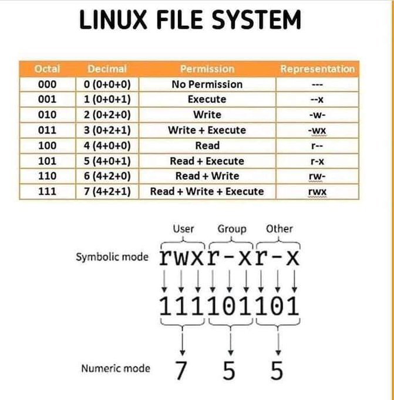

<br>
<br>

# Webserver Flowchart

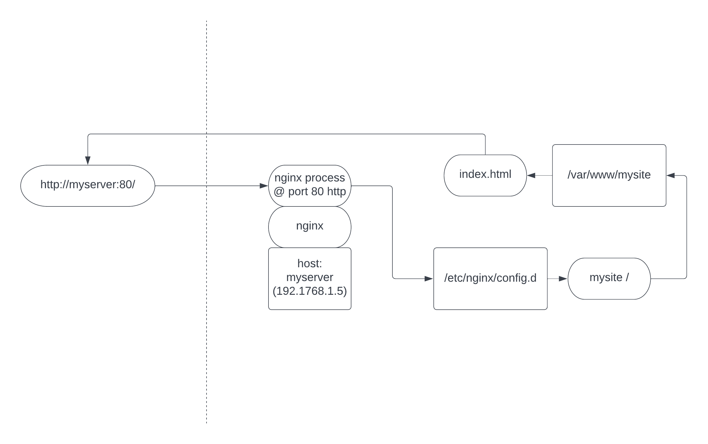


<br>
<br>

# Computer to website flowchart with ports

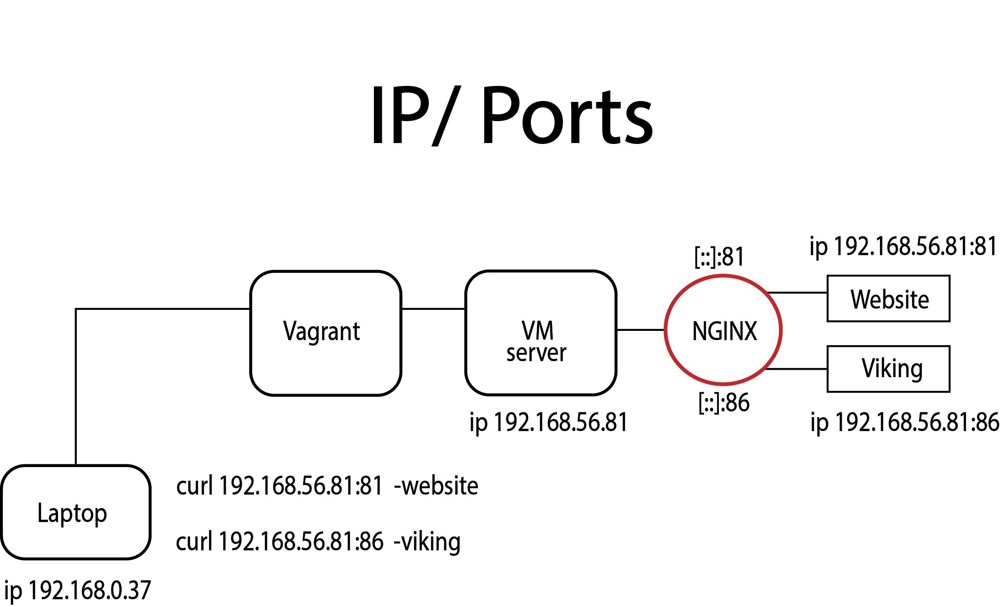

# devops-01

    build a webserver

    provision the infrastructure for a website

## Install dependencies

```
/bin/bash -c "$(curl -fsSL https://raw.githubusercontent.com/Homebrew/install/HEAD/install.sh)"

brew install virtualbox vagrant
```
<br>

### Create virtual machine
`vagrant up`

### Delete virtual machine
`vagrant destroy -f`

### Re-run provision
`vagrant up --provision`

### Test webserver
test from shell:

`curl 192.168.56.10`

### test from browser:
`http://192.168.56.10`

--- 
<br>

# Deploy website
Deploy a website to a webserver

<br>

## Create a webpage

---
# Operating Systems:
<br>

## Kernel: 
The kernel is a computer program at the core of a computer's operating system and generally has complete control over everything in the system. It is the portion of the operating system code that is always resident in memory and facilitates interactions between hardware and software components.

<br>

## Scheduler: 
In computing, scheduling is the action of assigning resources to perform tasks. The resources may be processors, network links or expansion cards. The tasks may be threads, processes or data flows. The scheduling activity is carried out by a process called scheduler.

<br>

## Input/Output:
Input/output management - it handles input to and output from attached hardware devices, such as the keyboard, mouse, monitor, hard disks, and printers. Ensuring that device drivers are present and up to date is another responsibility of the input/output management layer.

<br>

# User Space: 
A modern computer operating system usually segregates virtual memory into user space and kernel space. Primarily, this separation serves to provide memory protection and hardware protection from malicious or errant software behaviour.

<br>

# Programming Languages: 
## Assembly: 
Assembly language is the closest computer language to communicate with computers. It is the machine language (1s and 0s) that a CPU uses to operate in an easy to remember and understand format. Only assembly language can take the full advantages of the processor architecture, and it is hardware dependent.

<br>

## C Programming Language: 
C is a general-purpose computer programming language. It was created in the 1970s by Dennis Ritchie, and remains very widely used and influential. By design, C's features cleanly reflect the capabilities of the targeted CPUs.

<br>

## HTML: 
The HyperText Markup Language or HTML is the standard markup language for documents designed to be displayed in a web browser. It can be assisted by technologies such as Cascading Style Sheets and scripting languages such as JavaScript.

<br>

## Compiled Language:
A compiled language is a programming language which are generally compiled and not interpreted. It is one where the program, once compiled, is expressed in the instructions of the target machine; this machine code is undecipherable by humans. Types of compiled language – C, C++, C#, CLEO, COBOL, etc.

<br>

## Interpreted Language:
An interpreted language is a programming language which are generally interpreted, without compiling a program into machine instructions. It is one where the instructions are not directly executed by the target machine, but instead read and executed by some other program. Interpreted language ranges – JavaScript, Perl, Python, BASIC, etc.

<br>

## Network address translation (NAT):
is a method of mapping an IP address space into another by modifying network address information in the IP header of packets while they are in transit across a traffic routing device. 
<br>

The technique was originally used to avoid the need to assign a new address to every host when a network was moved, or when the upstream Internet service provider was replaced, but could not route the network's address space. It has become a popular and essential tool in conserving global address space in the face of IPv4 address exhaustion. One Internet-routable IP address of a NAT gateway can be used for an entire private network.

<br>


## The Domain Name System (DNS):
is the hierarchical and decentralized naming system used to identify computers reachable through the Internet or other Internet Protocol (IP) networks. The resource records contained in the DNS associate domain names with other forms of information. These are most commonly used to map human-friendly domain names to the numerical IP addresses computers need to locate services and devices using the underlying network protocols, but have been extended over time to perform many other functions as well. The Domain Name System has been an essential component of the functionality of the Internet since 1985.

<br>

## Difference Between IP Address and Hostname

An IP address is a logical numeric address that is assigned to every single computer, printer, switch, router or any other device that is part of a TCP/IP based network. A hostname is a label assigned to a network that transfers the user to a specific website. This is the main difference between IP address and hostname. Another difference between IP address and hostname is that IP address helps to identify a device in the network whereas hostname helps to find out the network that directs the user to a certain website or a webpage.

An IP address is a numerical label assigned to each device connected to a computer network that uses the Internet Protocol for communication. In contrast, a hostname is a label assigned to a network that sends the user to a specific website or a webpage. This is the main difference between IP address and Hostname.

<br>

## What is a computer network port?
A port in computer networking is how a computer can use a single physical network connection to handle many incoming and outgoing requests by assigning a port number to each. The numbers go from 0 to 65535, which is a 16-bit number.

Some of these port numbers are specifically defined and always associated with a specific type of service -- These are called well-known ports and go from 0 to 1023. The numbers from 1024 to 49151 are called registered ports and can be registered with the Internet Assigned Numbers Authority for a specific use. The numbers 49152 to 65535 are unassigned, can be used by any type of service and are called dynamic ports, private ports or ephemeral ports. 

As an illustration, think of a port number as a telephone extension in a business telephone system. The company telephone number is like the computer Internet Protocol (IP) address or Uniform Resource Locator (URL). It connects users with the correct company but does not define who they want to talk to in the company. A telephone extension will connect them with the right person in an organization, however, and the port will connect them to the right service on a computer. 

Dialing extension 0 to speak to an operator is extremely common in all phone systems and is like the well-known ports that always define specific services. The port is specified by having the URL or IP address followed by a colon then the port number -- as examples, 10.0.0.1:80 or www.techtarget.com:443. With all internet communication, there is always an associated port, but it may not be shown to the user as it is often implied by the type of communication.

<br>

---

### File Transfer Protocol (FTP) -is always port number 21 
---

### Hypertext Transfer Protocol -web traffic is always port 80
---

### SSH -the default port for SSH client connections is 22; to change this default, enter a port number between 1024 and 32,767
---

### HTTPS -connections by default, use TCP port 443
---

### HTTP -the unsecure protocol, uses port 80
---

### mySQL -Port 3306 is the default port for the classic MySQL protocol which is used by the mysql client, MySQL Connectors, and utilities such as mysqldump and mysqlpump.
---

<br>

## Port vs IP:
Port numbers identify a particular application or service on a system. An IP address identifies a machine in an IP network and determines the destination of a data packet, while port numbers identify particular applications or services on a system.